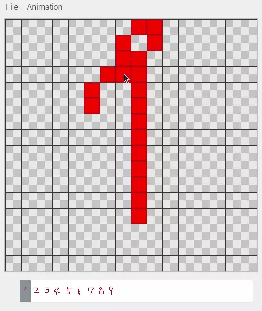

[ja](./README.ja.md)

# Pixpeer.SelectedListItem.Key

Select an item in the frame list by key operation.

# DEMO



# Requirement

* <time datetime="2020-05-13T16:33:00+0900">2020-05-13</time>
* [Raspbierry Pi](https://ja.wikipedia.org/wiki/Raspberry_Pi) 4 Model B Rev 1.2
* [Raspbian](https://ja.wikipedia.org/wiki/Raspbian) buster 10.0 2019-09-26 <small>[setup](http://ytyaru.hatenablog.com/entry/2019/12/25/222222)</small>
* bash 5.0.3(1)-release
* Qt 5.11
* Python 3.7.3
* PySide2
* Pillow 7.1.2

```sh
$ uname -a
Linux raspberrypi 4.19.97-v7l+ #1294 SMP Thu Jan 30 13:21:14 GMT 2020 armv7l GNU/Linux
```

# Usage

```sh
git clone https://github.com/ytyaru/Python.Pixpeer.SelectedListItem.Key.20200513163428
cd Python.Pixpeer.SelectedListItem.Key.20200513163428/src
./install.sh
./run.sh
```

# Author

ytyaru

* [](https://github.com/ytyaru "github")
* [](http://ytyaru.hatenablog.com/ytyaru "hatena")
* [](https://mstdn.jp/web/accounts/233143 "mastdon")

# License

This software is CC0 licensed.

[](http://creativecommons.org/publicdomain/zero/1.0/deed.en)

